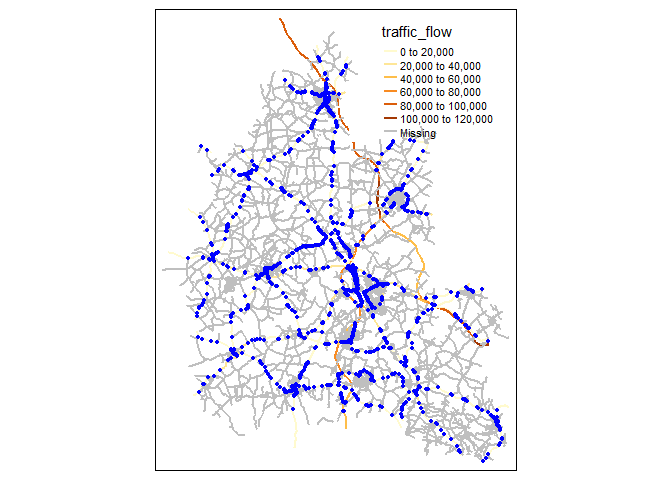
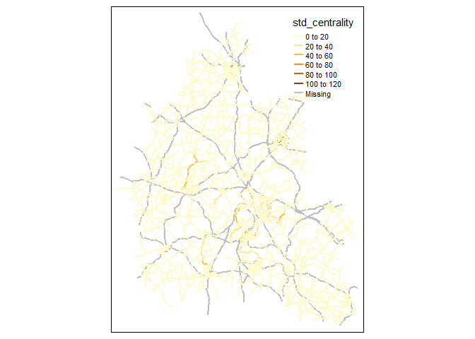
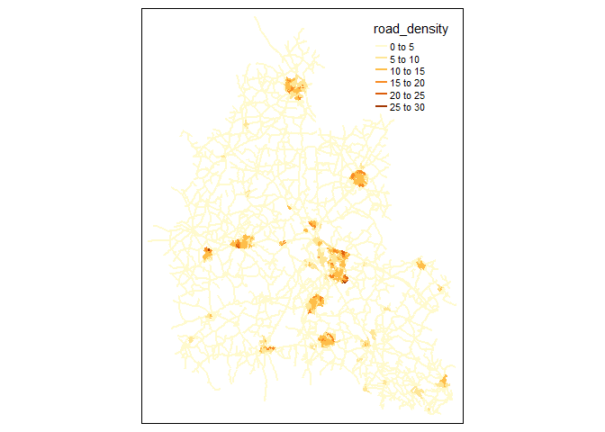
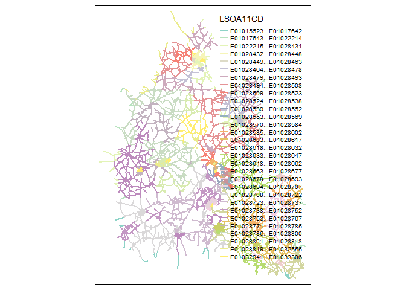
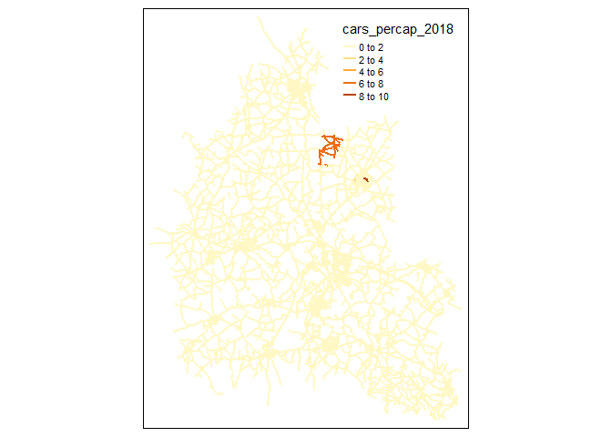
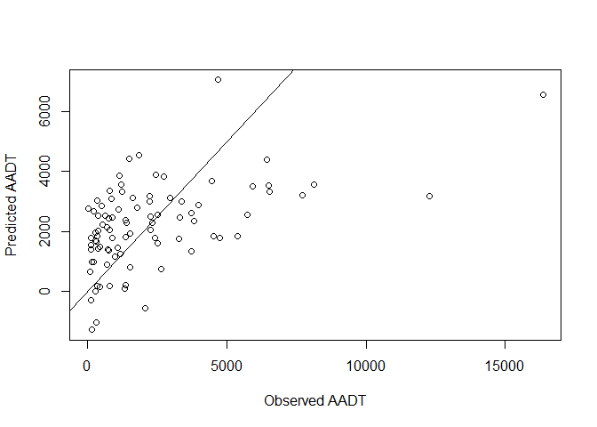
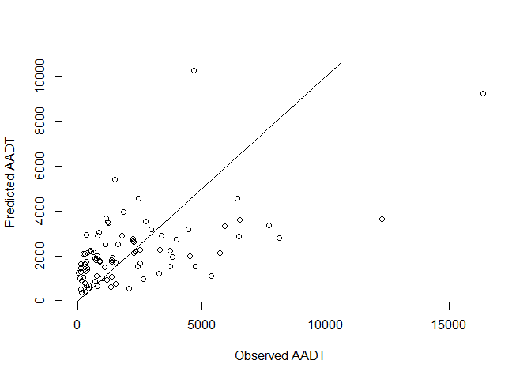
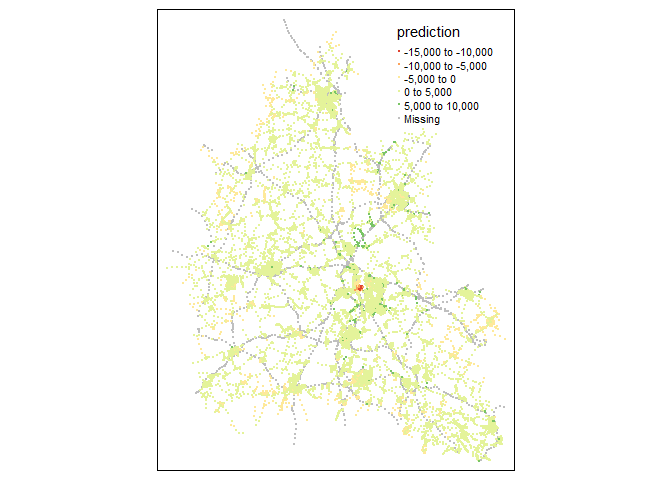

Oxfordshire Demo
================

``` r
library(MinorRoadTraffic)
library(GWmodel)
#> Loading required package: robustbase
#> Loading required package: sp
#> Loading required package: Rcpp
#> Welcome to GWmodel version 2.3-3.
library(tmap)
#> Breaking News: tmap 3.x is retiring. Please test v4, e.g. with
#> remotes::install_github('r-tmap/tmap')
library(sf)
#> Linking to GEOS 3.11.2, GDAL 3.8.2, PROJ 9.3.1; sf_use_s2() is TRUE
library(dplyr)
#> 
#> Attaching package: 'dplyr'
#> The following objects are masked from 'package:stats':
#> 
#>     filter, lag
#> The following objects are masked from 'package:base':
#> 
#>     intersect, setdiff, setequal, union
library(osmextract)
#> Data (c) OpenStreetMap contributors, ODbL 1.0. https://www.openstreetmap.org/copyright.
#> Check the package website, https://docs.ropensci.org/osmextract/, for more details.
```

Download raw data

Fix for internet problems
`assign("has_internet_via_proxy", TRUE, environment(curl::has_internet))`

``` r
osm_raw = osmextract::oe_get("Oxfordshire", 
                             extra_tags = c("ref","highway","junction","maxspeed"))
#> The input place was matched with: Oxfordshire
#> Downloading the OSM extract:
#>   |                                                                              |                                                                      |   0%  |                                                                              |                                                                      |   1%  |                                                                              |=                                                                     |   1%  |                                                                              |=                                                                     |   2%  |                                                                              |==                                                                    |   2%  |                                                                              |==                                                                    |   3%  |                                                                              |==                                                                    |   4%  |                                                                              |===                                                                   |   4%  |                                                                              |===                                                                   |   5%  |                                                                              |====                                                                  |   5%  |                                                                              |====                                                                  |   6%  |                                                                              |=====                                                                 |   6%  |                                                                              |=====                                                                 |   7%  |                                                                              |=====                                                                 |   8%  |                                                                              |======                                                                |   8%  |                                                                              |======                                                                |   9%  |                                                                              |=======                                                               |  10%  |                                                                              |=======                                                               |  11%  |                                                                              |========                                                              |  11%  |                                                                              |========                                                              |  12%  |                                                                              |=========                                                             |  12%  |                                                                              |=========                                                             |  13%  |                                                                              |=========                                                             |  14%  |                                                                              |==========                                                            |  14%  |                                                                              |==========                                                            |  15%  |                                                                              |===========                                                           |  15%  |                                                                              |===========                                                           |  16%  |                                                                              |============                                                          |  16%  |                                                                              |============                                                          |  17%  |                                                                              |============                                                          |  18%  |                                                                              |=============                                                         |  18%  |                                                                              |=============                                                         |  19%  |                                                                              |==============                                                        |  19%  |                                                                              |==============                                                        |  20%  |                                                                              |==============                                                        |  21%  |                                                                              |===============                                                       |  21%  |                                                                              |===============                                                       |  22%  |                                                                              |================                                                      |  22%  |                                                                              |================                                                      |  23%  |                                                                              |================                                                      |  24%  |                                                                              |=================                                                     |  24%  |                                                                              |=================                                                     |  25%  |                                                                              |==================                                                    |  25%  |                                                                              |==================                                                    |  26%  |                                                                              |===================                                                   |  26%  |                                                                              |===================                                                   |  27%  |                                                                              |===================                                                   |  28%  |                                                                              |====================                                                  |  28%  |                                                                              |====================                                                  |  29%  |                                                                              |=====================                                                 |  29%  |                                                                              |=====================                                                 |  30%  |                                                                              |=====================                                                 |  31%  |                                                                              |======================                                                |  31%  |                                                                              |======================                                                |  32%  |                                                                              |=======================                                               |  32%  |                                                                              |=======================                                               |  33%  |                                                                              |=======================                                               |  34%  |                                                                              |========================                                              |  34%  |                                                                              |========================                                              |  35%  |                                                                              |=========================                                             |  35%  |                                                                              |=========================                                             |  36%  |                                                                              |==========================                                            |  36%  |                                                                              |==========================                                            |  37%  |                                                                              |==========================                                            |  38%  |                                                                              |===========================                                           |  38%  |                                                                              |===========================                                           |  39%  |                                                                              |============================                                          |  40%  |                                                                              |============================                                          |  41%  |                                                                              |=============================                                         |  41%  |                                                                              |=============================                                         |  42%  |                                                                              |==============================                                        |  42%  |                                                                              |==============================                                        |  43%  |                                                                              |===============================                                       |  44%  |                                                                              |===============================                                       |  45%  |                                                                              |================================                                      |  46%  |                                                                              |=================================                                     |  46%  |                                                                              |=================================                                     |  47%  |                                                                              |=================================                                     |  48%  |                                                                              |==================================                                    |  48%  |                                                                              |==================================                                    |  49%  |                                                                              |===================================                                   |  49%  |                                                                              |===================================                                   |  50%  |                                                                              |===================================                                   |  51%  |                                                                              |====================================                                  |  51%  |                                                                              |====================================                                  |  52%  |                                                                              |=====================================                                 |  52%  |                                                                              |=====================================                                 |  53%  |                                                                              |=====================================                                 |  54%  |                                                                              |======================================                                |  54%  |                                                                              |======================================                                |  55%  |                                                                              |=======================================                               |  55%  |                                                                              |=======================================                               |  56%  |                                                                              |========================================                              |  56%  |                                                                              |========================================                              |  57%  |                                                                              |========================================                              |  58%  |                                                                              |=========================================                             |  58%  |                                                                              |=========================================                             |  59%  |                                                                              |==========================================                            |  59%  |                                                                              |==========================================                            |  60%  |                                                                              |==========================================                            |  61%  |                                                                              |===========================================                           |  61%  |                                                                              |===========================================                           |  62%  |                                                                              |============================================                          |  62%  |                                                                              |============================================                          |  63%  |                                                                              |============================================                          |  64%  |                                                                              |=============================================                         |  64%  |                                                                              |=============================================                         |  65%  |                                                                              |==============================================                        |  65%  |                                                                              |==============================================                        |  66%  |                                                                              |===============================================                       |  66%  |                                                                              |===============================================                       |  67%  |                                                                              |===============================================                       |  68%  |                                                                              |================================================                      |  68%  |                                                                              |================================================                      |  69%  |                                                                              |=================================================                     |  69%  |                                                                              |=================================================                     |  70%  |                                                                              |=================================================                     |  71%  |                                                                              |==================================================                    |  71%  |                                                                              |==================================================                    |  72%  |                                                                              |===================================================                   |  72%  |                                                                              |===================================================                   |  73%  |                                                                              |===================================================                   |  74%  |                                                                              |====================================================                  |  74%  |                                                                              |====================================================                  |  75%  |                                                                              |=====================================================                 |  75%  |                                                                              |=====================================================                 |  76%  |                                                                              |======================================================                |  77%  |                                                                              |=======================================================               |  78%  |                                                                              |=======================================================               |  79%  |                                                                              |========================================================              |  80%  |                                                                              |=========================================================             |  81%  |                                                                              |=========================================================             |  82%  |                                                                              |==========================================================            |  83%  |                                                                              |===========================================================           |  84%  |                                                                              |===========================================================           |  85%  |                                                                              |============================================================          |  86%  |                                                                              |=============================================================         |  87%  |                                                                              |==============================================================        |  88%  |                                                                              |==============================================================        |  89%  |                                                                              |===============================================================       |  89%  |                                                                              |===============================================================       |  90%  |                                                                              |===============================================================       |  91%  |                                                                              |================================================================      |  91%  |                                                                              |================================================================      |  92%  |                                                                              |=================================================================     |  92%  |                                                                              |=================================================================     |  93%  |                                                                              |=================================================================     |  94%  |                                                                              |==================================================================    |  94%  |                                                                              |==================================================================    |  95%  |                                                                              |===================================================================   |  95%  |                                                                              |===================================================================   |  96%  |                                                                              |====================================================================  |  96%  |                                                                              |====================================================================  |  97%  |                                                                              |====================================================================  |  98%  |                                                                              |===================================================================== |  98%  |                                                                              |===================================================================== |  99%  |                                                                              |======================================================================|  99%  |                                                                              |======================================================================| 100%
#> File downloaded!
#> Starting with the vectortranslate operations on the input file!
#> 0...10...20...30...40...50...60...70...80...90...100 - done.
#> Finished the vectortranslate operations on the input file!
#> Reading layer `lines' from data source 
#>   `C:\Users\earmmor\AppData\Local\Temp\RtmpMFQqRt\geofabrik_oxfordshire-latest.gpkg' 
#>   using driver `GPKG'
#> Simple feature collection with 141776 features and 13 fields
#> Geometry type: LINESTRING
#> Dimension:     XY
#> Bounding box:  xmin: -2.22718 ymin: 51.02358 xmax: -0.3806134 ymax: 52.1934
#> Geodetic CRS:  WGS 84

aadt = download_dft_aadt()
```

We also need some zonal statistics, here we will use data from the
[Place-Based Carbon Calculator](https://www.carbon.place) and employment
statistics from [NOMIS](https://www.nomisweb.co.uk)

``` r

zones = download_lsoa()
pbcc = download_pbcc()

zones = zones[,c("LSOA11CD")]
pbcc = pbcc[,c("LSOA11","pop_2018","cars_percap_2018")]

zones = dplyr::left_join(zones, pbcc, by = c("LSOA11CD" = "LSOA11"))
```

Subset AADT data to Oxfordshire in 2018

``` r
aadt = aadt[aadt$year == 2018,]
aadt = aadt[aadt$local_authority_name == "Oxfordshire",]
aadt$traffic_flow = aadt$all_motor_vehicles
```

Make a bounding polygon for the study area, and crop the OSM data to
that area.

``` r
bounds = make_convex_hull(aadt, 5000)
osm_clean = extract_from_osm(osm_raw, bounds)
network = osm_clean$network
junctions = osm_clean$junctions
```

If needed we can free up some RAM.

``` r
rm(osm_clean, osm_raw)
```

And we will subset our zone statistics

``` r
zones = zones[bounds,]
```

In the OSM roads don’t always have a ref value (e.g. A123), so lets
clean that up.

``` r
network = osm_fill_ref(network)
```

Before joining the AADT data to the road network, lets check that the
IDs match

``` r
summary(unique(aadt$road_name[aadt$road_type == "Major"]) %in% unique(network$ref))
#>    Mode    TRUE 
#> logical      32
```

In this case there are no missing IDs, sometimes a manual fix to the
data is needed.

Now assign the major road traffic counts to each part of the major road
network.

``` r
aadt_assign = assign_aadt_major(network, junctions, aadt, bounds)
network = aadt_assign$network
junctions_major_minor = aadt_assign$junctions_major_minor
```

Lets make a plot of our progress. Here we can see the minor roads in
grey and the major roads coloured by their AADT. Junctions between major
and minor roads are highlighted in blue. These junctions are important
as they are the places traffic can leave the major road network and join
the minor road network.

``` r

tm_shape(network) +
  tm_lines(lwd = 2, col = "traffic_flow") +
  tm_shape(junctions_major_minor) +
  tm_dots(col = "blue", size = 0.08)
```

<!-- -->
Now lets analyse the minor road network

``` r
network = minor_roads_distance(network, junctions_major_minor)
#> 0 roads are disconneted from the major road junctions
```

Calculate the centrality of minor roads. Centrality is a measure of the
importance of a road, with higher centrality suggesting it is a road
that connects different places together. Note calculating centrality on
large networks is time-consuming, so this function breaks the network
into zones based on the major road network. Note that a current
limitation is dealing with minor roads that have bridges over major
roads. As these link two zones together.

``` r
network = road_centrality(network)
#> although coordinates are longitude/latitude, st_contains_properly assumes that
#> they are planar
#> Doing Zone 1/38
#> Doing Zone 2/38
#> Doing Zone 3/38
#> Doing Zone 4/38
#> Doing Zone 5/38
#> Doing Zone 6/38
#> Doing Zone 7/38
#> Doing Zone 8/38
#> Doing Zone 9/38
#> Doing Zone 10/38
#> Doing Zone 11/38
#> Doing Zone 12/38
#> Doing Zone 13/38
#> Doing Zone 14/38
#> Doing Zone 15/38
#> Doing Zone 16/38
#> Doing Zone 17/38
#> Doing Zone 18/38
#> Doing Zone 19/38
#> Doing Zone 20/38
#> Doing Zone 21/38
#> Doing Zone 22/38
#> Doing Zone 23/38
#> Doing Zone 24/38
#> Doing Zone 25/38
#> Doing Zone 26/38
#> Doing Zone 27/38
#> Doing Zone 28/38
#> Doing Zone 29/38
#> Doing Zone 30/38
#> Doing Zone 31/38
#> Doing Zone 32/38
#> Doing Zone 33/38
#> Doing Zone 34/38
#> Doing Zone 35/38
#> Doing Zone 36/38
#> Doing Zone 37/38
#> Doing Zone 38/38
```

Lets check the results.

``` r
tm_shape(network) +
  tm_lines(lwd = 2, col = "std_centrality")
```

<!-- -->

Calculate road density. We will use the `use_centroids = TRUE` which is
faster but slight less accurate.

``` r
density = road_density(network, zones, use_centroids = TRUE)
#> Segmenting roads into sections of less than 1000 metres
network = density$network
zones = density$zones
```

An plot the results

``` r
tm_shape(network) +
  tm_lines(lwd = 2, col = "road_density")
```

<!-- -->

The road_density function also add the zone ID to each road. From the
first column in `zones`. We can use the ID to join on other zonal data
to the road network.

``` r
tm_shape(network) +
  tm_lines(lwd = 2, col = "LSOA11CD")
#> Warning: Number of levels of the variable "LSOA11CD" is 448, which is larger
#> than max.categories (which is 30), so levels are combined. Set
#> tmap_options(max.categories = 448) in the layer function to show all levels.
#> Legend labels were too wide. The labels have been resized to 0.63, 0.63, 0.63, 0.63, 0.63, 0.63, 0.63, 0.63, 0.63, 0.63, 0.63, 0.63, 0.63, 0.63, 0.63, 0.63, 0.63, 0.63, 0.63, 0.63, 0.63, 0.63, 0.63, 0.63, 0.63, 0.63, 0.63, 0.63, 0.63, 0.63. Increase legend.width (argument of tm_layout) to make the legend wider and therefore the labels larger.
```

<!-- -->

We can join on other variables from the zones data

``` r
network = dplyr::left_join(network, 
                           sf::st_drop_geometry(zones[,c("LSOA11CD","pop_2018","cars_percap_2018")]), 
                           by = "LSOA11CD")
```

``` r
tm_shape(network) +
  tm_lines(lwd = 2, col = "cars_percap_2018")
```

<!-- -->

Now we can assign our minor road traffic data and attempt to model the
missing data

``` r
aadt_minor <- st_buffer(aadt[aadt$road_type == "Minor",], 6)
aadt_minor <- aadt_minor[,"traffic_flow"]
names(aadt_minor)[1] = "traffic_flow_minor"
network <- st_join(network, aadt_minor)
summary(is.na(network$traffic_flow_minor))
#>    Mode   FALSE    TRUE 
#> logical      91   42997
```

Build a simple linear model

``` r
m1 = lm(traffic_flow_minor ~ log(major_flow) + log(nearest_junc_dist) + log(std_centrality) +
          log(road_density) + log(pop_2018) + log(cars_percap_2018),
        data = network)
summary(m1)
#> 
#> Call:
#> lm(formula = traffic_flow_minor ~ log(major_flow) + log(nearest_junc_dist) + 
#>     log(std_centrality) + log(road_density) + log(pop_2018) + 
#>     log(cars_percap_2018), data = network)
#> 
#> Residuals:
#>     Min      1Q  Median      3Q     Max 
#> -2916.8 -1492.1  -441.4   989.9  9801.7 
#> 
#> Coefficients:
#>                        Estimate Std. Error t value Pr(>|t|)   
#> (Intercept)            12012.06    8564.40   1.403  0.16443   
#> log(major_flow)          962.99     458.09   2.102  0.03853 * 
#> log(nearest_junc_dist)  -859.84     255.50  -3.365  0.00115 **
#> log(std_centrality)      302.18      99.74   3.030  0.00325 **
#> log(road_density)       -291.20     312.77  -0.931  0.35450   
#> log(pop_2018)          -1998.21     905.30  -2.207  0.03002 * 
#> log(cars_percap_2018)   -693.62     848.98  -0.817  0.41624   
#> ---
#> Signif. codes:  0 '***' 0.001 '**' 0.01 '*' 0.05 '.' 0.1 ' ' 1
#> 
#> Residual standard error: 2333 on 84 degrees of freedom
#>   (42997 observations deleted due to missingness)
#> Multiple R-squared:  0.275,  Adjusted R-squared:  0.2232 
#> F-statistic: 5.311 on 6 and 84 DF,  p-value: 0.0001099
```

We get an R-squared of 0.278 which is not great.

``` r
plot(network$traffic_flow_minor[!is.na(network$traffic_flow_minor)], predict(m1),
     xlab = "Observed AADT",
     ylab = "Predicted AADT")
abline(0,1)
```

<!-- -->
Now try a Geographically Weighted Regression

``` r


#GWR uses points not lines
cents = st_centroid(network)
#> Warning: st_centroid assumes attributes are constant over geometries
cents$log_std_centrality = log(cents$std_centrality)
cents$log_nearest_junc_dist = log(cents$nearest_junc_dist)
cents$log_major_flow = log(cents$major_flow)

cents_test = cents[!is.na(cents$traffic_flow_minor),]

DM = gw.dist(dp.locat = st_coordinates(cents_test))

# Define Equation
eq = traffic_flow_minor ~ log_std_centrality + log_nearest_junc_dist + log_major_flow +
  pop_2018 + cars_percap_2018

# Determine the adaptive bandwidth
abw <- bw.ggwr(eq,
               data = as(cents_test, "Spatial"),
               family = "poisson",
               approach = "AICc",
               kernel = "bisquare", 
               adaptive = TRUE,
               dMat = DM)
#>  Iteration    Log-Likelihood(With bandwidth:  63 )
#> =========================
#>        0      -7.564e+04 
#>        1      -5.254e+04 
#>        2      -5.419e+04 
#>        3      -5.32e+04 
#>        4      -5.286e+04 
#>        5      -5.284e+04 
#>        6      -5.285e+04 
#>        7      -5.285e+04 
#>        8      -5.285e+04 
#> Adaptive bandwidth (number of nearest neighbours): 63 AICc value: 105733.6 
#>  Iteration    Log-Likelihood(With bandwidth:  47 )
#> =========================
#>        0      -6.495e+04 
#>        1      -4.985e+04 
#>        2      -4.661e+04 
#>        3      -4.403e+04 
#>        4      -4.303e+04 
#>        5      -4.27e+04 
#>        6      -4.266e+04 
#>        7      -4.267e+04 
#>        8      -4.267e+04 
#>        9      -4.267e+04 
#>       10      -4.267e+04 
#> Adaptive bandwidth (number of nearest neighbours): 47 AICc value: 85400.66 
#>  Iteration    Log-Likelihood(With bandwidth:  35 )
#> =========================
#>        0      -4.76e+04 
#>        1      -5.554e+04 
#>        2      -3.817e+04 
#>        3      -3.159e+04 
#>        4      -2.956e+04 
#>        5      -2.881e+04 
#>        6      -2.856e+04 
#>        7      -2.854e+04 
#>        8      -2.855e+04 
#>        9      -2.855e+04 
#>       10      -2.855e+04 
#> Adaptive bandwidth (number of nearest neighbours): 35 AICc value: 57199.62 
#>  Iteration    Log-Likelihood(With bandwidth:  30 )
#> =========================
#>        0      -3.957e+04 
#>        1      -3.876e+04 
#>        2      -2.854e+04 
#>        3      -2.463e+04 
#>        4      -2.375e+04 
#>        5      -2.343e+04 
#>        6      -2.337e+04 
#>        7      -2.337e+04 
#>        8      -2.337e+04 
#> Adaptive bandwidth (number of nearest neighbours): 30 AICc value: 46871.35 
#>  Iteration    Log-Likelihood(With bandwidth:  24 )
#> =========================
#>        0      -3.081e+04 
#>        1      -2.626e+04 
#>        2      -2.051e+04 
#>        3      -1.835e+04 
#>        4      -1.792e+04 
#>        5      -1.78e+04 
#>        6      -1.779e+04 
#>        7      -1.779e+04 
#>        8      -1.779e+04 
#> Adaptive bandwidth (number of nearest neighbours): 24 AICc value: 35771.81 
#>  Iteration    Log-Likelihood(With bandwidth:  23 )
#> =========================
#>        0      -2.959e+04 
#>        1      -2.384e+04 
#>        2      -1.906e+04 
#>        3      -1.73e+04 
#>        4      -1.694e+04 
#>        5      -1.686e+04 
#>        6      -1.685e+04 
#>        7      -1.685e+04 
#>        8      -1.685e+04 
#> Adaptive bandwidth (number of nearest neighbours): 23 AICc value: 33898.87 
#>  Iteration    Log-Likelihood(With bandwidth:  20 )
#> =========================
#>        0      -2.273e+04 
#>        1      -1.694e+04 
#>        2      -1.45e+04 
#>        3      -1.357e+04 
#>        4      -1.337e+04 
#>        5      -1.335e+04 
#>        6      -1.335e+04 
#>        7      -1.335e+04 
#> Adaptive bandwidth (number of nearest neighbours): 20 AICc value: 26932.87 
#>  Iteration    Log-Likelihood(With bandwidth:  20 )
#> =========================
#>        0      -2.273e+04 
#>        1      -1.694e+04 
#>        2      -1.45e+04 
#>        3      -1.357e+04 
#>        4      -1.337e+04 
#>        5      -1.335e+04 
#>        6      -1.335e+04 
#>        7      -1.335e+04 
#> Adaptive bandwidth (number of nearest neighbours): 20 AICc value: 26932.87

# Fit GWPR
gwpr4 <- ggwr.basic(eq, 
                    data = as(cents_test, "Spatial"), 
                    family = "poisson",
                    bw = abw,
                    kernel = "gaussian",
                    adaptive = TRUE,
                    dMat = DM)
#>  Iteration    Log-Likelihood
#> =========================
#>        0      -7.757e+04 
#>        1      -5.525e+04 
#>        2      -5.672e+04 
#>        3      -5.572e+04 
#>        4      -5.542e+04 
#>        5      -5.541e+04 
#>        6      -5.541e+04 
#>        7      -5.541e+04

gwpr4
#>    ***********************************************************************
#>    *                       Package   GWmodel                             *
#>    ***********************************************************************
#>    Program starts at: 2025-02-13 14:25:12.672342 
#>    Call:
#>    ggwr.basic(formula = eq, data = as(cents_test, "Spatial"), bw = abw, 
#>     family = "poisson", kernel = "gaussian", adaptive = TRUE, 
#>     dMat = DM)
#> 
#>    Dependent (y) variable:  traffic_flow_minor
#>    Independent variables:  log_std_centrality log_nearest_junc_dist log_major_flow pop_2018 cars_percap_2018
#>    Number of data points: 91
#>    Used family: poisson
#>    ***********************************************************************
#>    *              Results of Generalized linear Regression               *
#>    ***********************************************************************
#> 
#> Call:
#> NULL
#> 
#> Coefficients:
#>                         Estimate Std. Error z value Pr(>|z|)    
#> Intercept              7.117e+00  4.363e-02  163.10   <2e-16 ***
#> log_std_centrality     1.358e-01  9.915e-04  136.94   <2e-16 ***
#> log_nearest_junc_dist -2.765e-01  1.885e-03 -146.64   <2e-16 ***
#> log_major_flow         3.190e-01  4.042e-03   78.93   <2e-16 ***
#> pop_2018              -6.231e-04  5.755e-06 -108.27   <2e-16 ***
#> cars_percap_2018      -2.684e-01  6.726e-03  -39.90   <2e-16 ***
#> ---
#> Signif. codes:  0 '***' 0.001 '**' 0.01 '*' 0.05 '.' 0.1 ' ' 1
#> 
#> (Dispersion parameter for poisson family taken to be 1)
#> 
#>     Null deviance: 211572  on 90  degrees of freedom
#> Residual deviance: 135264  on 85  degrees of freedom
#> AIC: 135276
#> 
#> Number of Fisher Scoring iterations: 5
#> 
#> 
#>  AICc:  135277.2
#>  Pseudo R-square value:  0.3606719
#>    ***********************************************************************
#>    *          Results of Geographically Weighted Regression              *
#>    ***********************************************************************
#> 
#>    *********************Model calibration information*********************
#>    Kernel function: gaussian 
#>    Adaptive bandwidth: 20 (number of nearest neighbours)
#>    Regression points: the same locations as observations are used.
#>    Distance metric: A distance matrix is specified for this model calibration.
#> 
#>    ************Summary of Generalized GWR coefficient estimates:**********
#>                                Min.    1st Qu.     Median    3rd Qu.    Max.
#>    Intercept              4.0963978  5.8423857  7.4982534  8.4555841 10.1548
#>    log_std_centrality     0.0817952  0.1120800  0.1359407  0.1615858  0.2166
#>    log_nearest_junc_dist -0.3582646 -0.3017101 -0.2339527 -0.2149817 -0.1710
#>    log_major_flow         0.1578450  0.2327888  0.3030232  0.4300101  0.5696
#>    pop_2018              -0.0015712 -0.0010855 -0.0007286 -0.0005686 -0.0004
#>    cars_percap_2018      -1.0850423 -0.3723072 -0.2451291 -0.1775756  0.0353
#>    ************************Diagnostic information*************************
#>    Number of data points: 91 
#>    GW Deviance: 110020.1 
#>    AIC : 110048 
#>    AICc : 110053.6 
#>    Pseudo R-square value:  0.4799888 
#> 
#>    ***********************************************************************
#>    Program stops at: 2025-02-13 14:25:12.74464
```

GWR improves the R-squared to 0.36 again not great, but much better.

``` r
plot(cents_test$traffic_flow_minor,gwpr4$glms$fitted.values,
     xlab = "Observed AADT",
     ylab = "Predicted AADT")
abline(0,1)
```

<!-- -->

Now predict traffic for all roads

``` r
cents_predict = cents[is.na(cents$traffic_flow_minor),]
#cents_predict = cents_predict[is.na(cents_predict$traffic_flow),]
cents_test = cents[!is.na(cents$traffic_flow_minor),]
DM1 = gw.dist(dp.locat = st_coordinates(cents_test), rp.locat = st_coordinates(cents_predict))
DM2 = gw.dist(dp.locat = st_coordinates(cents_test))

# Fit GWPR
pred = gwr.predict(eq, 
                    data=as(cents_test, "Spatial"),
                    predictdata = as(cents_predict, "Spatial"),
                    bw = abw,
                    kernel = "gaussian",
                    adaptive = TRUE,
                    dMat1 = DM1,
                    dMat2 = DM2)
prediction = st_as_sf(pred$SDF) 
```

Join back onto network

``` r
network_predit = network[is.na(network$traffic_flow_minor),]
network_predit$prediction = prediction$prediction
```

``` r
tm_shape(network_predit) +
  tm_dots(col = "prediction")
#> Variable(s) "prediction" contains positive and negative values, so midpoint is set to 0. Set midpoint = NA to show the full spectrum of the color palette.
```

<!-- -->
